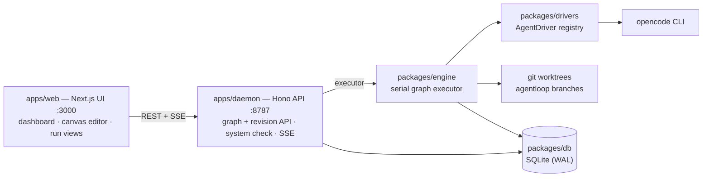

# Openeuler — visually design your software team of coding agents

A local-first web app where you compose coding agents into a **graph on a canvas** — implementer, reviewer, fixer, docs writer — wire them with conditional edges and loops, then run the whole team against a task in an isolated git worktree and watch the graph execute live.

- **Design on a canvas** — drag agent nodes from a palette, connect them with `always` chain edges or conditional router edges (first match wins, `always` is the fallback), add loop-back edges with iteration caps and `exit` markers; undo/redo, auto-layout, inline validation with node/edge badges
- **Build a reusable roster** — save any configured agent as a preset ("Senior Reviewer", "Test Writer"); new nodes copy its config, "Update from preset" is always explicit; every project starts with three builtin presets
- **Run in the background** — every run executes the workflow's **pinned revision** in its own git worktree on an `agentloop/<runId>` branch; runs for different projects execute concurrently
- **Watch live** — the run view renders the graph as it executes (nodes queue/run/complete, edges light up as they are taken, all over SSE); scrub finished runs step by step; per-node and cumulative diffs; stop/resume/retry
- **Set up in four steps** — a first-run wizard checks your environment (git, opencode CLI), opens a project, and launches a starter workflow

## Architecture



- **`apps/web`** (Next.js 15, port 3000): dashboard (project cards, activity feed, live runs table), the **canvas editor** for workflow graphs (palette, node/edge inspectors, presets manager, validation panel), and the run detail page with a live **Graph** tab plus Events / Diff / Timeline tabs.
- **`apps/daemon`** (Hono, port 8787): REST APIs for projects/files/workflows/graph-revisions/runs/presets/drivers/system-check, the executor (two-layer scheduler: global semaphore + per-project gate), a boot recovery sweep, and SSE streaming (per-run event replay + a global run-status stream).
- **`packages/engine`**: the **serial graph executor** — one edge per node completion, conditional routing, per-edge cycle guards — plus the legacy linear flow/loop engine for pre-graph workflows, and the git worktree manager (one worktree + branch per run).
- **`packages/drivers`**: the pluggable agent layer — the `AgentDriver` contract, a registry, a scripted `fake` driver, and the real `opencode` driver. See [packages/drivers/README.md](packages/drivers/README.md).
- **`packages/db`**: Drizzle ORM over SQLite (WAL), repositories for projects/workflows/workflow-revisions/runs/step-runs/events/agent-presets.
- **`packages/core`**: zod-validated domain schemas shared by everything (including the `WorkflowGraph` schema and its cross-field validation).

## Prerequisites

- **Node.js ≥ 20**
- **pnpm** (`corepack enable` or `npm i -g pnpm`)
- **git ≥ 2.31** (the worktree manager uses `git rev-parse --path-format=absolute`)
- **opencode CLI** — only needed to run real agents with the `opencode` driver: [install it](https://opencode.ai/docs/install) and run `opencode auth login` once. The default driver is `fake`, which needs no agent at all.

## Quickstart — through the wizard

```bash
pnpm install
pnpm build   # once after cloning: the apps import the workspace packages' dist/
pnpm dev
```

`pnpm dev` starts the daemon (:8787) and the web app (:3000) together. Open **http://localhost:3000** — the health pill in the top-right should say _Daemon healthy_. On a fresh database (no projects, no workflows yet) the dashboard forwards you straight to the setup wizard at **`/welcome`**.

<!-- TODO(#54): screenshot — welcome wizard, environment step (replace when screenshots are captured) -->
<!-- TODO(#54): screenshot — dashboard 2.0: project cards, activity feed, runs table -->

The wizard has four steps, skippable at any time via **Skip setup** (bottom-left); re-run it later from **Settings → Re-run setup wizard**:

1. **Environment** — the daemon probes git, the opencode CLI (version + auth) and the worktree store (`GET /api/system/check`, cached 30s; **Re-check** bypasses the cache). git and a writable worktree store are hard requirements; a missing or unauthenticated opencode only warns — workflows can still run on the `fake` driver.
2. **Project** — enter an absolute path to a local git repo (it must have at least one commit) and press **Open**, or pick an already-registered project from the list.
3. **Starter** — choose one of three cards:
   - **Implement → Review → Fix loop** — the reviewer is a router: output containing `LGTM` exits, anything else loops back through a fixer, bounded by the loop edge's `maxIterations 3`
   - **Feature pipeline** — implement → tests → docs, a linear chain passing context via `{{output:<nodeId>}}`
   - **Blank canvas** — a single entry agent prompted with `{{task}}`
4. **Launch** — describe the task and press **Launch first run**. Openeuler creates the workflow (revision 1 snapshots the starter's graph) and drops you on the run page with the live **Graph** tab.

<!-- TODO(#54): screenshot — canvas editor with palette, node inspector and edge drawer (replace when screenshots are captured) -->

**Watching the run** — the run page (`/runs/<id>`) shows the header (status, executions, duration, Stop/Retry) over four tabs:

- **Graph** — the run's pinned revision rendered read-only; nodes light up queued/running/success/failed as events stream in, taken edges brighten and the last taken edge animates; clicking a node opens its executions and diffs. Finished runs get a **replay scrubber** (prev/next/play through the execution breadcrumb).
- **Events** — the raw SSE feed (agent deltas, tool calls, `node.*`/`edge.*` routing events, `run.status` transitions) with reconnect and replay-from-cursor.
- **Diff** — per-step (per-node) incremental diffs and the cumulative run diff, split view.
- **Timeline** — the execution breadcrumb as a flat list.

**Editing the team** — from the project's **Workflows** tab open a workflow's **Edit** page: the canvas. Drag **Agent step** / **Exit node** from the left palette's **Steps** section, or a preset from its **Your team** section, connect handles to draw edges, click a node or edge to edit it in the right drawer (prompt with insert-variable buttons and live preview, condition type + pattern + regex, router evaluation order, loop `maxIterations`, `invert`), then **Save** (⌘/Ctrl+S) — every save snapshots a new immutable revision. Keyboard shortcuts, validation badges on the canvas, and the presets manager (**Manage** next to "Your team") round it out; the `?` button in the toolbar lists all shortcuts.

The same flow works headless against the API:

```bash
# environment preflight (what the wizard's step 1 shows)
curl -s localhost:8787/api/system/check

# register a project (any local git repo with ≥ 1 commit)
curl -s localhost:8787/api/projects -H 'content-type: application/json' \
  -d '{"path":"/path/to/repo"}'

# list registered drivers (fake + opencode)
curl -s localhost:8787/api/drivers

# create a graph workflow (revision 1 snapshots this graph)…
curl -s localhost:8787/api/workflows -H 'content-type: application/json' -d '{
  "projectId": "<project-id>",
  "name": "smoke",
  "graph": {
    "entryNodeId": "worker",
    "nodes": [
      { "id": "worker", "type": "agent", "name": "Worker",
        "position": { "x": 0, "y": 0 },
        "config": { "driver": "fake", "mode": "auto",
                    "promptTemplate": "Do the task: {{task}}",
                    "continueSession": false } },
      { "id": "exit", "type": "exit", "name": "Exit",
        "position": { "x": 560, "y": 0 } }
    ],
    "edges": [
      { "id": "e-worker-exit", "source": "worker", "target": "exit",
        "condition": { "type": "always" } }
    ]
  }
}'

# …run it (the run pins the latest revision)…
curl -s localhost:8787/api/workflows/<workflow-id>/runs -H 'content-type: application/json' \
  -d '{"task":"write a haiku about worktrees"}'

# …and watch the run (node.*/edge.* routing events + agent events + run.status)
curl -sN localhost:8787/api/runs/<run-id>/events
```

### Drivers: `fake` vs `opencode`

- The **`fake`** driver is the default (`OPENEULER_DRIVER=fake`). It runs no agent: it streams a minimal scripted event sequence and exits cleanly, so you can exercise the whole engine/UI/API without any CLI. It is also the driver new canvas nodes get by default (the first registered driver) — perfect for smoke tests.
- The **`opencode`** driver spawns one `opencode run` child per node execution (`--format json`, `--auto` for `mode: "auto"`). The starter templates use it; make sure `opencode` is installed and authenticated first (the wizard's environment step tells you exactly what is missing).

## Environment variables

Read at process start (no `.env` file is loaded; export them or prefix the command):

| Variable                 | Used by                 | Default                    | Meaning                                                                             |
| ------------------------ | ----------------------- | -------------------------- | ----------------------------------------------------------------------------------- |
| `OPENEULER_DB`           | `@openeuler/db`         | `<repo>/data/openeuler.db` | SQLite database file path                                                           |
| `OPENEULER_WORKTREES`    | `@openeuler/engine`     | `~/.openeuler/worktrees`   | Root directory for per-run git worktrees                                            |
| `OPENEULER_DRIVER`       | daemon executor, engine | `fake`                     | Driver for **ad-hoc** runs (`POST /api/runs`); graph nodes carry their own `driver` |
| `MAX_CONCURRENT_RUNS`    | daemon executor         | `2`                        | Global cap on runs executing at once (integer ≥ 1; echoed by `/health`)             |
| `PORT`                   | daemon                  | `8787`                     | Daemon HTTP port                                                                    |
| `CORS_ORIGIN`            | daemon                  | `http://localhost:3000`    | Allowed browser origin                                                              |
| `OPENEULER_TOKEN`        | daemon                  | _(unset = open)_           | Bearer token required on every `/api` route (#92) — see "Token auth" below          |
| `OPENEULER_SECRET_KEY`   | daemon                  | `<data>/secret.key`        | Path to the master key file for project secrets (#93) — see "Per-project secrets"   |
| `LOG_LEVEL`              | daemon                  | `info`                     | pino log level                                                                      |
| `NEXT_PUBLIC_DAEMON_URL` | `@openeuler/web`        | `http://localhost:8787`    | Daemon base URL for the browser app                                                 |

## Token auth (opt-in)

Local-first defaults to **open** (no auth) for `localhost` dev; expose the daemon to a LAN and you want a gate. Set `OPENEULER_TOKEN` before starting the daemon:

```bash
OPENEULER_TOKEN=$(openssl rand -hex 32) pnpm dev
```

- Every `/api/*` route then requires `Authorization: Bearer <token>` (compared in constant time; a wrong/missing token answers `401 {"error":{"code":"UNAUTHORIZED"}}`).
- **Web**: the browser stores the token in localStorage (`openeuler.token`). On the first 401 a full-page card asks for the token, saves it and retries the failed action; Settings shows whether the daemon runs with auth (`GET /api/system/auth-status`, always open).
- **SSE streams** (`/api/runs/:id/events`, `/api/runs/stream`): `EventSource` cannot set headers, so these GET streaming routes (only these) also accept `?token=<token>`. The tradeoff: the token appears in URLs — visible to proxies between browser and daemon, which is why the fallback is scoped strictly to streaming routes and the daemon redacts `token=` from its logs.
- **`/health`** stays open for liveness probes but answers minimal info (`ok` + version) while auth is on.
- **Rotation**: change the env var and restart the daemon; in the web, save the new token when the 401 card appears (or hit **Forget token** in Settings first). No logout dance beyond that.

## Per-project secrets (redacted everywhere)

Agents need credentials (npm tokens, API keys) without them landing in prompts, events, or logs. Register them per project and every run of that project receives them as env vars — while the daemon scrubs the values from everything it persists.

- **Storage**: `PUT /api/projects/:id/secrets {name, value}` upserts (same name = rotate). Values are encrypted at rest with AES-256-GCM using a master key file generated on first boot (`<data>/secret.key`, mode 600; override the path with `OPENEULER_SECRET_KEY`). **Back the key up with your database — losing it makes stored secrets undecryptable.** The API only ever lists names (`GET …/secrets` → `[{name, createdAt}]`); values are write-only over the wire, and the web UI (project workspace → header gear → Settings) shows write-only inputs.
- **Names** follow env-var rules: `^[A-Z_][A-Z0-9_]*$`, ≤ 64 chars (422 otherwise). Values shorter than 4 characters are not redacted (they would match unrelated text).
- **Injection**: at run start the executor decrypts the project's secrets and merges them into every agent process env (`{...process.env, ...secrets}` in the `opencode` driver).
- **Redaction**: every persisted write for a run — event payloads, StepRun output/diff, run output/error, activity feed payloads — replaces each value with `***NAME***` (case-sensitive substring, longest values first). Run-tagged structured log fields are redacted the same way; the snapshot is taken at run start, so a secret rotated mid-run stays redacted for that run. Pragmatic scope: a value that only appears in a non-run-tagged log line (e.g. a plain HTTP access log) is out of scope — secrets belong in outputs/events, which are fully covered.
- **Failure mode is fail-closed**: if secrets cannot be decrypted (wrong/tampered key file → `SECRETS_KEY_UNREADABLE`), the run fails instead of executing without redaction.

## Project layout

```
apps/
  web/        Next.js 15 UI (dashboard, canvas editor, run views, wizard)
  daemon/     Hono API server + executor (scheduler, recovery, SSE, system check)
packages/
  core/       zod domain schemas (WorkflowGraph, presets, runs, events)
  db/         Drizzle + SQLite schema, migrations, repositories (incl. revisions, presets)
  engine/     serial graph executor + legacy flow engine + worktree manager
  drivers/    AgentDriver contract, registry, fake + opencode drivers
data/         default SQLite location (gitignored)
```

Deep dives — graph model semantics, revision pinning, the canvas data flow, presets, daemon internals, adding a new agent driver, template authoring, troubleshooting: see **[docs/DEV.md](docs/DEV.md)**.

## Troubleshooting

- **`opencode` not found / not authenticated** — the wizard's environment step flags it (with the exact `opencode auth login` hint); a run using the `opencode` driver fails with error code `OPENCODE_NOT_FOUND` ("opencode CLI not found on PATH … authenticate with `opencode auth login`"). Install from <https://opencode.ai/docs/install>, run `opencode auth login`, then **Re-check** in the wizard (or retry the run).
- **Worktree errors on empty repos** — opening a repo with no commits returns a warning ("repository has no commits yet; branch creation will fail…"); the run then fails at worktree creation with `EMPTY_REPO`. Fix: `git commit --allow-empty -m init` in the repo. A non-repo path is rejected at open time with `NOT_A_GIT_REPOSITORY`.
- **Port conflicts** — daemon defaults to 8787, web to 3000. Move the daemon with `PORT=9000 pnpm dev` and point the UI at it with `NEXT_PUBLIC_DAEMON_URL=http://localhost:9000`; also update `CORS_ORIGIN` if the web origin moves. The web port is Next.js's own (`next dev -p`).
- **Daemon down** — the health pill in the top bar shows _Daemon unreachable_ and API calls surface `NETWORK_ERROR`. Restart with `pnpm dev`.
- **Interrupted runs after a crash** — on boot the daemon sweeps runs left `queued`/`running` by a dead process and marks them `interrupted`. Their detail page offers **Resume** (continues in place, reusing the worktree and agent sessions — only when every started node recorded a session id) or **Retry as new run** (always available; fresh run id/branch/worktree, pinned to the workflow's **current** latest revision).
- **Old runs look different from the edited workflow** — runs pin the revision that was latest when they were created; editing a workflow afterwards never re-runs old runs. The run's Graph tab badges which revision it shows (`pinned revision N`, or `legacy workflow` for pre-graph runs). See [docs/DEV.md](docs/DEV.md) for details.
