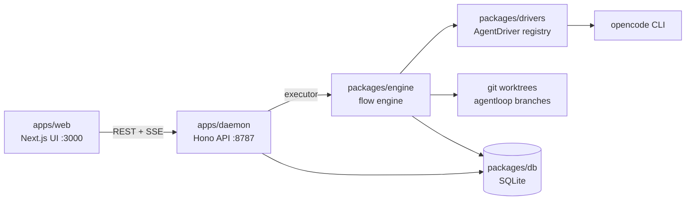

# Openeuler — Agent Loop Manager

A local-first web app for defining and running **workflows (flows & loops) of coding agents** in the background.

- **Open a project** like VSCode/Zed: point it at a local git repo
- **Define workflows**: an ordered list of fully user-defined agent steps (e.g. opencode in auto-approve mode), with optional loop-back edges and exit conditions (`flow` or `loop`)
- **Run in background**: each run executes in an isolated git worktree on its own branch; multiple runs concurrently
- **Watch live**: streaming agent events (SSE), per-step diffs, iteration counts, stop/resume/retry

## Architecture



- **`apps/web`** (Next.js 15, port 3000): dashboard, project workspace with file browser, workflow builder, run detail with a live SSE event feed and a diff viewer (per-step + cumulative).
- **`apps/daemon`** (Hono, port 8787): REST APIs for projects/files/workflows/runs/drivers, plus the executor — a two-layer scheduler (global semaphore + per-project gate) and a boot recovery sweep for runs orphaned by a crash.
- **`packages/engine`**: the flow engine — multi-step flow/loop execution, prompt templating, session chaining, per-step diff snapshots — and the git worktree manager (one worktree + `agentloop/<runId>` branch per run).
- **`packages/drivers`**: the pluggable agent layer — the `AgentDriver` contract, a registry, a scripted `fake` driver, and the real `opencode` driver. See [packages/drivers/README.md](packages/drivers/README.md).
- **`packages/db`**: Drizzle ORM over SQLite (WAL), repositories for projects/workflows/runs/step runs/events.
- **`packages/core`**: zod-validated domain schemas shared by everything.

## Prerequisites

- **Node.js ≥ 20**
- **pnpm** (`corepack enable` or `npm i -g pnpm`)
- **git ≥ 2.31** (the worktree manager uses `git rev-parse --path-format=absolute`)
- **opencode CLI** — only needed to run real agents with the `opencode` driver: [install it](https://opencode.ai/docs/install) and run `opencode auth login` once. The default driver is `fake`, which needs no agent at all.

## Quickstart

```bash
pnpm install
pnpm dev
```

`pnpm dev` starts the daemon (:8787) and the web app (:3000) together. Open **http://localhost:3000** — the health pill in the top-right should say _Daemon healthy_.

1. **Open a project** — on the Projects page, open any local git repo (it must have at least one commit).
2. **Build your first workflow** — in the project's Workflows tab: add a step (driver `fake` for a smoke test, `opencode` for the real thing), write a `promptTemplate` using `{{task}}` / `{{prevOutput}}` / `{{iterations}}`, optionally enable the loop-back edge with an exit condition.
3. **Run it** — "Run workflow", give it a task, watch events stream in on the run page; the Diffs tab shows per-step and cumulative diffs.

The same flow works headless against the API:

```bash
# register a project (any local git repo with ≥ 1 commit)
curl -s localhost:8787/api/projects -H 'content-type: application/json' \
  -d '{"path":"/path/to/repo"}'

# list registered drivers (fake + opencode)
curl -s localhost:8787/api/drivers

# create + run a workflow
curl -s localhost:8787/api/workflows -H 'content-type: application/json' -d '{
  "projectId": "<project-id>",
  "name": "smoke",
  "steps": [
    { "id": "s1", "name": "worker", "driver": "fake", "mode": "auto",
      "promptTemplate": "Do the task: {{task}}", "continueSession": false }
  ]
}'
curl -s localhost:8787/api/workflows/<workflow-id>/runs -H 'content-type: application/json' \
  -d '{"task":"write a haiku about worktrees"}'

# watch the run
curl -sN localhost:8787/api/runs/<run-id>/events
```

### Drivers: `fake` vs `opencode`

- The **`fake`** driver is the default (`OPENEULER_DRIVER=fake`). It runs no agent: it streams a minimal scripted event sequence and exits cleanly, so you can exercise the whole engine/UI/API without any CLI. Workflow steps choose a driver per step — pick `fake` there too for smoke tests.
- The **`opencode`** driver spawns one `opencode run` child per step (`--format json`, `--auto` for `mode: "auto"`). Point steps (or ad-hoc runs) at it by setting `driver: "opencode"` / `OPENEULER_DRIVER=opencode`, and make sure `opencode` is installed and authenticated first.

## Environment variables

Read at process start (no `.env` file is loaded; export them or prefix the command):

| Variable                 | Used by                 | Default                    | Meaning                                                                                |
| ------------------------ | ----------------------- | -------------------------- | -------------------------------------------------------------------------------------- |
| `OPENEULER_DB`           | `@openeuler/db`         | `<repo>/data/openeuler.db` | SQLite database file path                                                              |
| `OPENEULER_WORKTREES`    | `@openeuler/engine`     | `~/.openeuler/worktrees`   | Root directory for per-run git worktrees                                               |
| `OPENEULER_DRIVER`       | daemon executor, engine | `fake`                     | Driver for **ad-hoc** runs (`POST /api/runs`); workflow steps carry their own `driver` |
| `MAX_CONCURRENT_RUNS`    | daemon executor         | `2`                        | Global cap on runs executing at once (integer ≥ 1; echoed by `/health`)                |
| `PORT`                   | daemon                  | `8787`                     | Daemon HTTP port                                                                       |
| `CORS_ORIGIN`            | daemon                  | `http://localhost:3000`    | Allowed browser origin                                                                 |
| `LOG_LEVEL`              | daemon                  | `info`                     | pino log level                                                                         |
| `NEXT_PUBLIC_DAEMON_URL` | `@openeuler/web`        | `http://localhost:8787`    | Daemon base URL for the browser app                                                    |

## Project layout

```
apps/
  web/        Next.js 15 UI (dashboard, workspace file browser, workflow builder, run detail)
  daemon/     Hono API server + executor (scheduler, recovery, SSE)
packages/
  core/       zod domain schemas (Project, Workflow, Run, StepRun, events)
  db/         Drizzle + SQLite schema, migrations, repositories
  engine/     flow engine (flows/loops, prompt templating) + worktree manager
  drivers/    AgentDriver contract, registry, fake + opencode drivers
data/         default SQLite location (gitignored)
```

Deep dives — data model, engine semantics, daemon internals, adding a new agent driver, testing conventions: see **[docs/DEV.md](docs/DEV.md)**.

## Troubleshooting

- **`opencode` not found / not authenticated** — a run using the `opencode` driver fails with error code `OPENCODE_NOT_FOUND` ("opencode CLI not found on PATH … authenticate with `opencode auth login`"). Install from <https://opencode.ai/docs/install>, run `opencode auth login`, then retry the run.
- **Worktree errors on empty repos** — opening a repo with no commits returns a warning ("repository has no commits yet; branch creation will fail…"); the run then fails at worktree creation with `EMPTY_REPO`. Fix: `git commit --allow-empty -m init` in the repo. A non-repo path is rejected at open time with `NOT_A_GIT_REPOSITORY`.
- **Port conflicts** — daemon defaults to 8787, web to 3000. Move the daemon with `PORT=9000 pnpm dev` and point the UI at it with `NEXT_PUBLIC_DAEMON_URL=http://localhost:9000`; also update `CORS_ORIGIN` if the web origin moves. The web port is Next.js's own (`next dev -p`).
- **Daemon down** — the health pill in the top nav shows _Daemon unreachable_ and API calls surface `NETWORK_ERROR`. Restart with `pnpm dev`.
- **Interrupted runs after a crash** — on boot the daemon sweeps runs left `queued`/`running` by a dead process and marks them `interrupted`. Their detail page offers **Resume** (continues in place, reusing the worktree and agent sessions — only when every started step recorded a session id) or **Retry as new run** (always available; fresh run id/branch/worktree).
